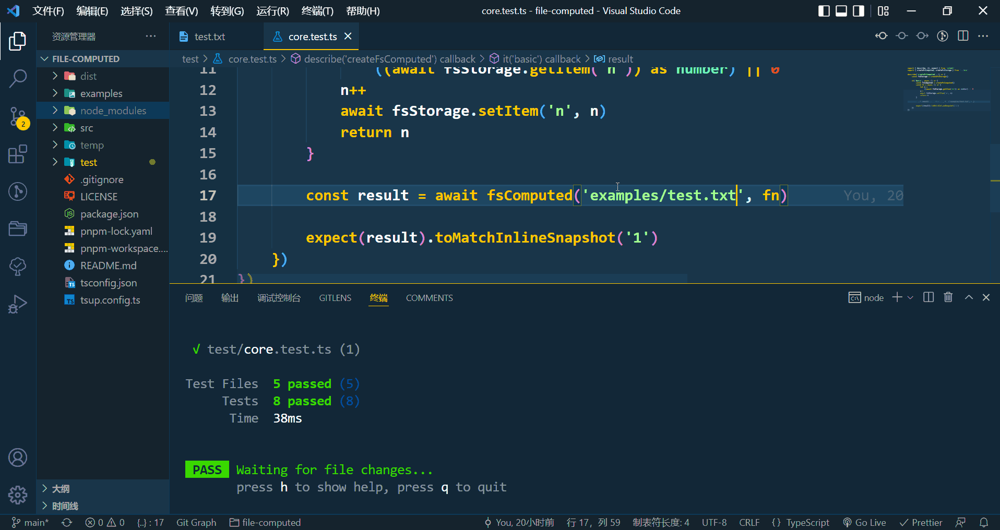

<div align="center">
    
    <h1>file-computed</h1>
    <p>文件型计算属性，当且仅当文件内容发生变化时才重新做计算</p>
</div>

<br />

## 动机

有时候我们的计算在特定目标文件不变时结果是一样的，当计算特别耗时复杂时可以通过本地文件缓存的方式快速得到原先的结果，而不需要每一次都进行该计算，以此提高运算效率。

<br />
<br />

## 使用

### 安装

```shell
pnpm i file-computed
```

<br />

### 基础

```ts
import { createFsComputed } from 'file-computed'

const fsComputed = createFsComputed()

const result = await fsComputed('package.json', () => {
	/** 模拟复杂计算，只会跑一次，后边会直接获取缓存中的结果 */
	let n = 0
	let t = 10000
	while (t--) {
		n++
	}
	return n
})

result // 10000
```

<br />

### 缓存路径

```ts
import { createFsComputed } from 'file-computed'

const fsComputed = createFsComputed({
	cachePath: 'temp' // 默认为最近 node_modules 的 .cache/.file-computed
})
```

<br />

### 同步

```ts
import { createFsComputedSync } from 'file-computed'

const fsComputed = createFsComputedSync()

const result = fsComputed('package.json', () => {
	/** 模拟复杂计算，只会跑一次，后边会直接获取缓存中的结果 */
	let n = 0
	let t = 10000
	while (t--) {
		n++
	}
	return n
})

result // 10000
```

<br />

### 流

适合大型缓存

```ts
import { createFsComputedWithStream } from 'file-computed'

const fsComputed = createFsComputedWithStream()

const result = await fsComputed('package.json', () => {
	/** 模拟复杂计算，只会跑一次，后边会直接获取缓存中的结果 */
	let n = 0
	let t = 10000
	while (t--) {
		n++
	}
	return n
})

result // 10000
```

#### 后置写

开启 `post`，结果将优先返回，速度更快

```ts
import { createFsComputedWithStream } from 'file-computed'

const fsComputed = createFsComputedWithStream({
	post: true
})

const result = await fsComputed('package.json', () => {
	let n = 0
	let t = 10000
	while (t--) {
		n++
	}
	return n
})

result // 写被后置了，结果 10000 优先返回
```

因为写被后置了，所以下次计算前，缓存与否是不确定的

<br />
<br />

## License

Made with [markthree](https://github.com/markthree)

Published under [MIT License](./LICENSE).

<br />
